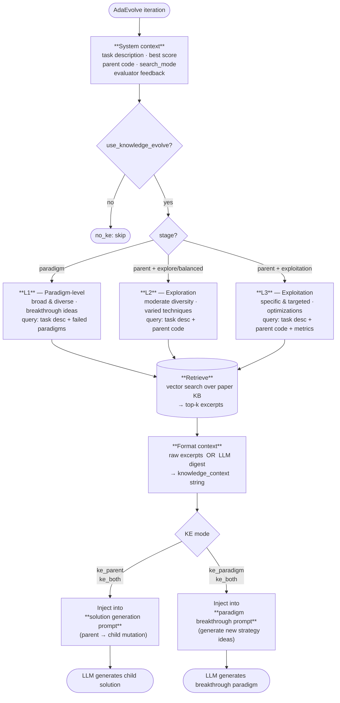

## AdaEvolve × Knowledge Evolve — Flow

```mermaid
flowchart TD
    START([AdaEvolve iteration]) --> CTX

    CTX["**System context**
    task description · best score
    parent code · search_mode
    evaluator feedback"]

    CTX --> KECHECK{use_knowledge_evolve?}

    KECHECK -- no --> NOKE([no_ke: skip])

    KECHECK -- yes --> STAGE{stage?}

    STAGE -- paradigm --> L1BOX
    STAGE -- parent + exploitation --> L3BOX
    STAGE -- parent + explore/balanced --> L2BOX

    L1BOX["**L1** — Paradigm-level
    broad & diverse · breakthrough ideas
    query: task desc + failed paradigms"]

    L2BOX["**L2** — Exploration
    moderate diversity · varied techniques
    query: task desc + parent code"]

    L3BOX["**L3** — Exploitation
    specific & targeted · optimizations
    query: task desc + parent code + metrics"]

    L1BOX --> RETRIEVE
    L2BOX --> RETRIEVE
    L3BOX --> RETRIEVE

    RETRIEVE[("**Retrieve**
    vector search over paper KB
    → top-k excerpts")]

    RETRIEVE --> FORMAT["**Format context**
    raw excerpts  OR  LLM digest
    → knowledge_context string"]

    FORMAT --> INJECT{KE mode}

    INJECT -- ke_parent\nke_both --> PARENT_PROMPT["Inject into
    **solution generation prompt**
    (parent → child mutation)"]

    INJECT -- ke_paradigm\nke_both --> PARADIGM_PROMPT["Inject into
    **paradigm breakthrough prompt**
    (generate new strategy ideas)"]

    PARENT_PROMPT --> GEN_CHILD([LLM generates child solution])
    PARADIGM_PROMPT --> GEN_PARA([LLM generates breakthrough paradigm])
```
